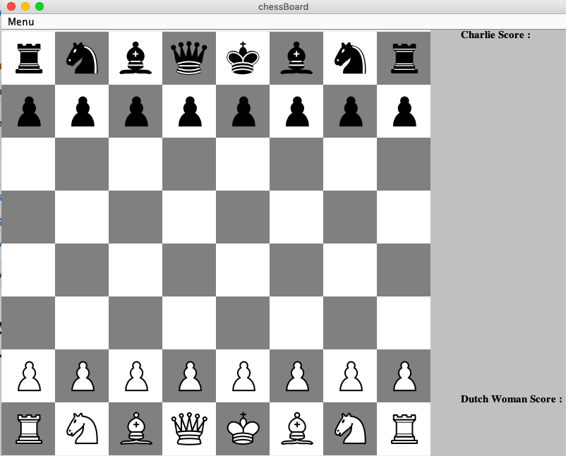

# Project Name
> chess

## Table of contents
* [General info](#general-info)
* [Screenshots](#screenshots)
* [Technologies](#technologies)
* [Setup](#setup)
* [Features](#features)
* [Status](#status)
* [Inspiration](#inspiration)
* [Contact](#contact)

## General info
Add more general information about project. What the purpose of the project is? Motivation?

## Technologies
* Tech 1 - version 1.0
* Tech 2 - version 2.0
* Tech 3 - version 3.0

## Setup
clone the project to local using git, and then build the project. The starting phase should looks like the screenshot shown below.

## Screenshots

## Code Examples
Show examples of usage:
`put-your-code-here`

## Features
List of features ready
* Awesome feature 1
* Awesome feature 2
* Awesome feature 3

## License

Distributed under the MIT License.

## Contact

[Mingli Yang]https://www.linkedin.com/in/myang46/

Project Link: [https://github.com/charlieyyy/chess](https://github.com/charlieyyy/chess)
